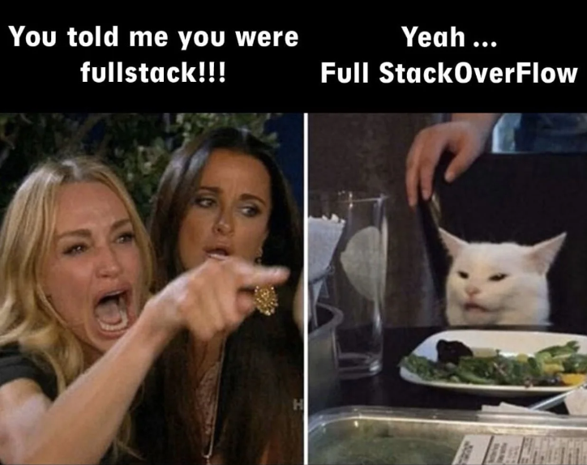

  

<h2 align='center'>디지털 약자가 없는 세상을 만들어 가고 싶은 개발자 곽성은입니다👋</h2>
 

  

<h4 align="center">
  IT의 발전이 빨라지는 만큼, '디지털 약자'의 어려움도 늘어납니다.
   '디지털 약자'들은 어디로 가야할까요?
   진정한 의미의 모두를 위한 서비스를 개발하고 싶습니다 😀
  <h3 align='center'>"Communication"</h3>
</h4>
 

<h2>💫About Me</h2>
<ul>
  <li>모든 사람이 <b>쓰기 쉬운 서비스</b>를 개발하고 싶습니다.</li>
  <li><b>문제 해결을 위한 커뮤니케이션 능력</b>을 갖춘 개발자가 되기 위해 달려가는 중입니다.</li>
  <li><b>탄탄한 기본기</b>를 위해 스스로 공부하고 발전하고 있습니다.</li>
</ul>
 

<h2>🏃🏻‍♀️My Activities & Projects</h2>
<ul>
  <li><b>신한투자증권 프로디지털 아카데미 5기</b> (2024.09~) - 클라우드 기반의 웹 풀스택 개발 교육</li>
  <li><b><a href='http://www.cla-school.com'>WFK ICT 해외봉사단 팀 "K-hana"</a></b> (2024.07~2024.08) - 해외파견 ICT 교육 및 학교 웹사이트 프로젝트 수행</li>
  <li><b>서울시립대학교 전자전기컴퓨터공학부 재학</b> (2021.03~)</li>
  <li><b>전자전기컴퓨터공학부 소모임 EcE</b> (2023.01~2024.08) - 학실 대여 예약 사이트 프로젝트 수행</li>
  <li><b>학습공동체 "B.B.B"</b> (2023.09~2023.11) - 비콘과 연동된 시각장애인을 위한 버스 예약 앱 개발</li>
  <li>개인 프로젝트 - 자동주식매매 기능을 포함한 펀드 앱 프로젝트 수행</li>
</ul>

<table>
  <tr>
    <td width="50%">
      <h3>날 성장시킨: 🪙자동주식매매 펀딩 앱</h3>
      

        한국투자증권 API를 활용해보는 경험과 Springboot로 RestAPI 개발을 비롯한 백엔드부터 프론트엔드까지 온전히 스스로 해결했습니다. 그리고 자동주식매매 로직을 위해 투자 개념과 전략에 대해 공부하며 성장했습니다.
      

    </td>
    <td width="50%">
      <h3>내가 좋아하는: 🏫네팔 학교 웹사이트</h3>
      

        네팔에 파견되어 Node.js와 JS 숙련도를 키웠습니다. 기획부터 디자인, 개발, 배포, 도메인 설정까지 몸으로 부딛혀가며 배웠습니다. 봉사를 하며 사회 문제나 ‘디지털 포용성’에 대해서도 생각하며 가치관에 영향을 미쳤습니다.
      

    </td>
  </tr>
</table>
 

<h2>👩🏻‍🏫My Certification</h2>  
<ul>
  <li>정보처리기사 (2024.06.18)</li>
  <li>SQLD (2023.12.15)</li>
  <li>AI-900 (2024.07.14)</li>
  <li>SC-900 (2024.07.20)</li>
</ul>
 

<h2 align='center'>💻Tech Experience</h2>

  
              

  

 
<h2 align='center'>📊GitHub Stats</h2> 

  
  

 
<h2 align='center'>🔗See More & Connect with me</h2>

  
  
  

