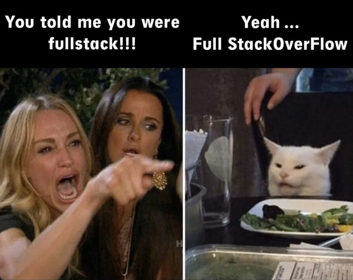

<!-- Header -->

  

 

<!-- Careers -->
<h2>💼 Careers</h2>
<ul>
  <li><b>한화시스템ICT</b> (2026.01~) - 자산운용 SAP 개발 🆕</li>
  <li>게딱지 (2025.04~2025.12) - 국내 게스트하우스 숙박-구인구직 플랫폼 프론트엔드 개발</li>
  <li>신한투자증권(인턴) (2025.04~2025.05) - 정보계 개발</li>
</ul>

 

<!-- Activities & Projects -->
<h2>🏃🏻‍♀️ My Activities & Projects</h2>
<ul>
  <li>예비관광벤처 선정 및 WorkAway 개발 (2025.04~2025.12) - 국내 게스트하우스 숙박-구인구직 플랫폼 프론트엔드 개발</li>
  <li>신한투자증권 인턴십 (2025.04~2025.05) - 사내 REST API 공통 모듈 개발 및 경제지표 별 종목·섹터 영향도 분석 플랫폼 개발</li>
  <li>신한투자증권 프로디지털 아카데미 5기 (2024.09~2025.03) - 클라우드 기반의 웹 풀스택 개발 교육</li>
  <li>WFK ICT 해외봉사단 팀 "K-hana" (2024.07~2024.08) - 해외파견 ICT 교육 및 학교 웹사이트 프로젝트 수행</li>
  <li>학습공동체 "B.B.B"</b> (2023.09~2023.11) - 비콘과 연동된 시각장애인을 위한 버스 예약 앱 개발</li>
  <li>전자전기컴퓨터공학부 소모임 EcE (2023.01~2024.08) - 학실 대여 예약 사이트 프로젝트 수행</li>
  <li>서울시립대학교 전자전기컴퓨터공학부 재학 (2021.03~2025.02)</li>
</ul>

<table>
  <tr>
    <td width="50%" valign="top">
      <h3>날 성장시킨: 🪙 실시간 공시 요약 및 트레이딩 플랫폼</h3>
      

        공시 요약(AI) 및 실시간 체결가 API, 그리고 프론트엔드 전반에 참여했습니다.
        데이터 수집부터 백엔드, 프론트까지 프로젝트 전반에 참여하며 기술적으로 성장할 수 있었습니다.
      

    </td>
    <td width="50%" valign="top">
      <h3>내가 좋아하는: 🏫 네팔 학교 웹사이트</h3>
      

        네팔에 파견되어 Node.js와 JS 숙련도를 키웠습니다. 기획부터 디자인, 개발, 배포, 도메인 설정까지 직접 수행했습니다.
        봉사를 하며 사회 문제나 ‘디지털 포용성’에 대해서도 생각하며 가치관에 영향을 미쳤습니다.
      

    </td>
  </tr>
</table>

 

<!-- Certification -->
<h2>👩🏻‍🏫 My Certification</h2>
<ul>
  <li>SC-900 (2024.07.20)</li>
  <li>AI-900 (2024.07.14)</li>
  <li>정보처리기사 (2024.06.18)</li>
  <li>SQLD (2023.12.15)</li>
</ul>

 

<!-- Tech Experience -->
<h2 align="center">💻 Tech Experience</h2>

  
  
  
  
  
  
  
  
  
  
  
  
  

  

 

<!-- gitanimals -->

  

 

<!-- Links -->
<h2 align="center">🔗 See More & Connect with me</h2>

  
  
  

